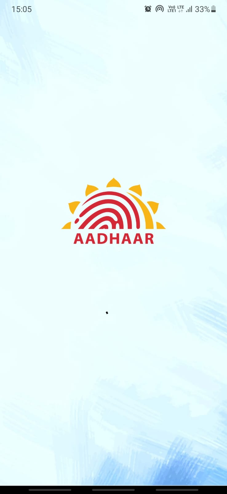
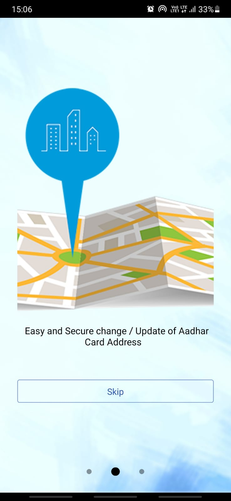
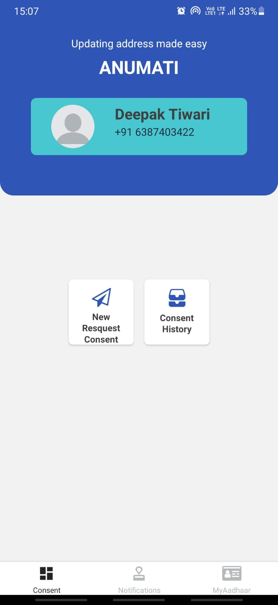
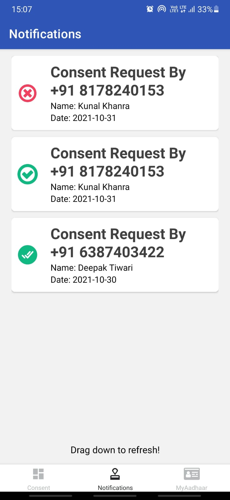
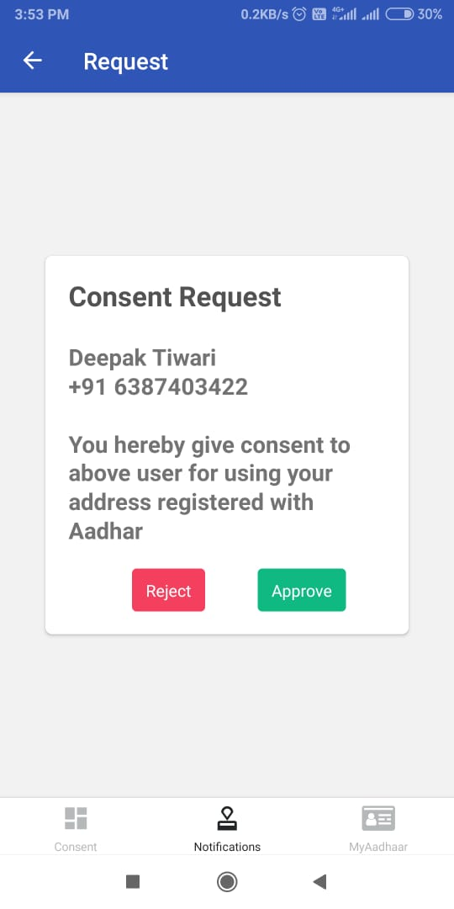
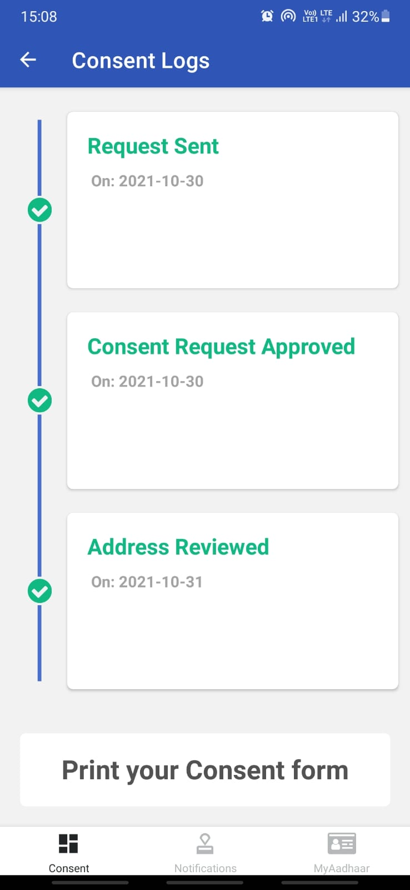

# Aadhar-Hackathon-Anumati
An App built during Aadhar Hackathon 2021 for easing out the process of address update when someone living in a rented space and do not have any proof of current address

**Theme** - Address Update\
**Problem Statement** - Address Update Challenge in Urban Areas

### Presentation
[Click here](https://github.com/deep0711/Aadhar-Hackathon-Anumati/issues/19)
### Screenshots
                                       

### Video Demo
[Click here](https://github.com/deep0711/Aadhar-Hackathon-Anumati/issues/20)

### Android APK File for Testing
<a href="APK/Anumati-client-b1ba1e0a95504ccab3303fa89c85dd97-signed.apk" download>Download</a>\
Click on the Download button above which will redirect to the page containing APK File. Click Download button there present on right side to download the apk file. Install it on an Android Phone to test the app
### Team
**Team Name** - Code-it-all \
**Members** - \
Deepak Tiwari \
Kunal Khanra \
Roshan Rai
